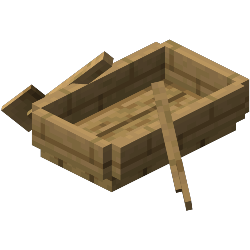

  

<h1 align="center">RusherHack 1.20.4 - BoatExecute</h1>

---
### A RusherHack module plugin for 1.20.4 that exploits boat movement packets to instantly kill all passengers. 
---

## Features

- **Instant Boat Kill:** Automatically kills any user within a boat by exploiting boat movement packets.
- **Server Compatibility:** Only works on servers that are running PaperMC.
- **Version:** 1.20.4.

## Installation

1. Download the latest release from the [Releases](https://github.com/PhilipPanda/RusherHack-BoatExecute/releases/) section.
2. Place the `.jar` file in your Minecraft `.minecraft/rusherhack/plugins/` directory.
3. Run the command `*reload` to load the plugin.

## Showcase

[Showcase Video](https://www.youtube.com/watch?v=h35gKz9ZQK4&t=31s)
